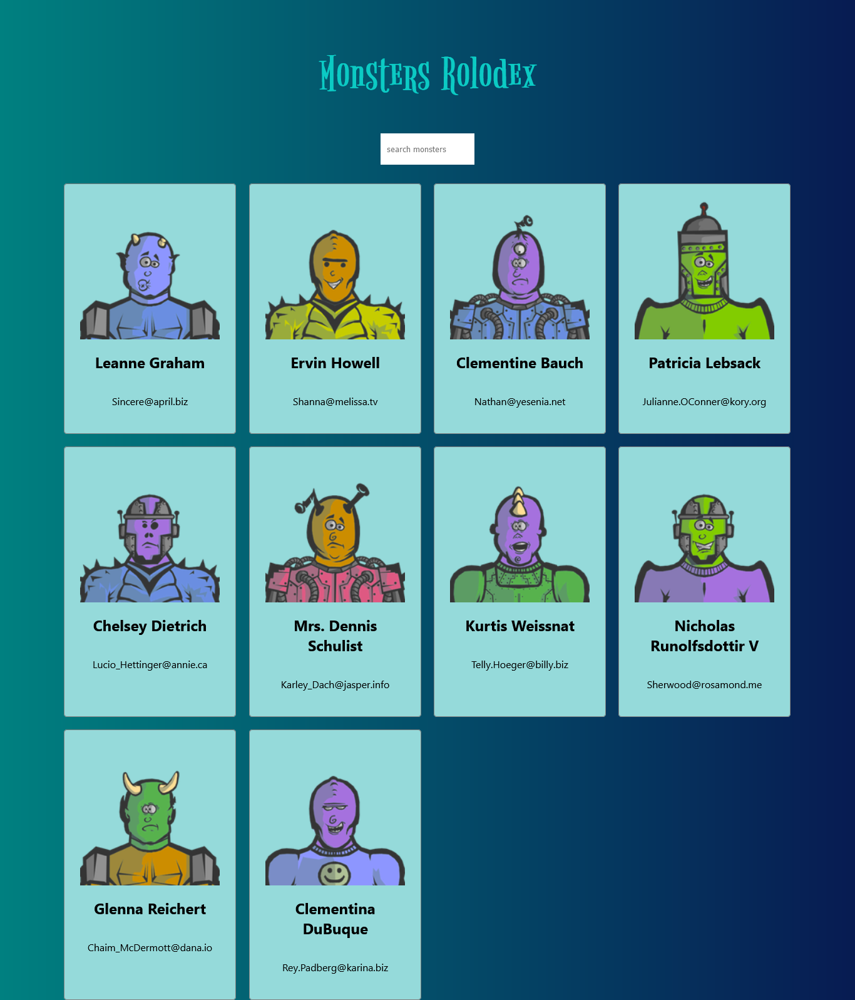

<h1>Monster Rolodex</h1>

<h2>A monster rolodex keeping created using React.</h2>

This monster rolodex was created using React which allows you to look up monster's names to see if any match. Screenshot of the website.

- Live Site: [Monster Rolodex](https://monsters-rolodex-beginners-project.netlify.app/)

### Screenshot

